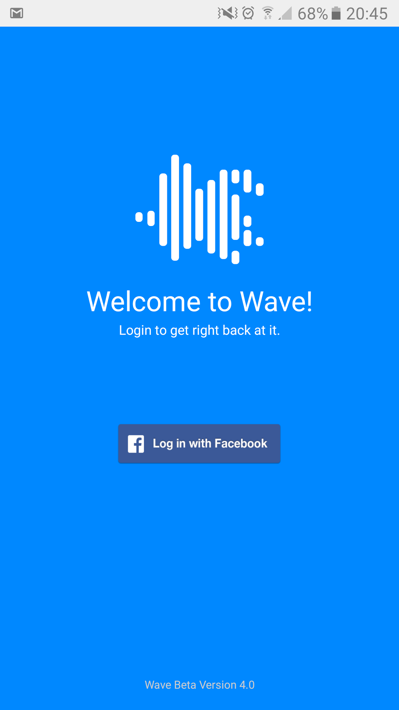
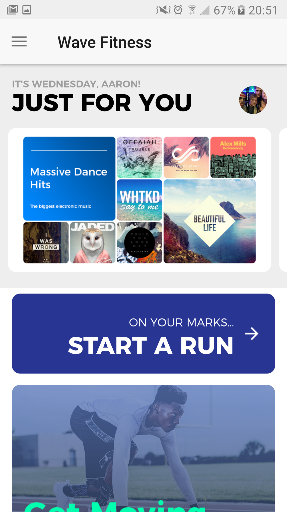
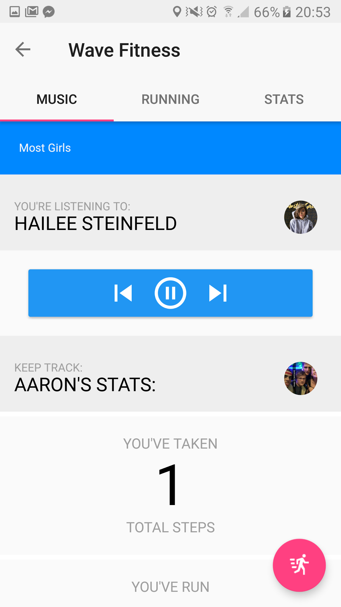
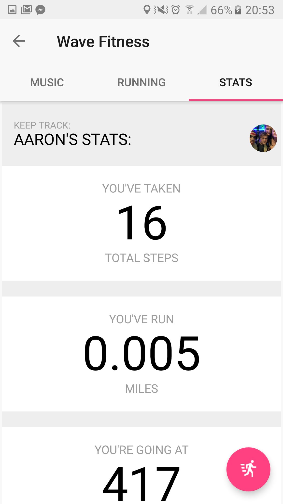

# WaveFitness
This is the Official Repo for Wave Fitness, an app dedicated to helping music lovers enjoy their exercise more.

# What is Wave?
Wave is an Android App, created to let people discover new music personalised to their tastes whilst they exercise. It includes a custom music player, music discovery, GPS Map tracking, and statistics about how far you've run, how many calories you've burnt and more.

# Where can I use it?
It isn't officially available on Google Play. If you wish, you can download the repo and run it via Android Studio, however the project is finished as the University Course it was created for is complete. 

# Screenshots

| Login Page | Dashboard |
------------ | -------------
 | 
| Genre Selection | Music Player |
 | 
| Quick Info | Running Statistic |
 | 

# Reference

* Buffer Social (2013) Why Facebook Is Blue: The Science of Colors in Marketing, 
  * Available at:  https://blog.bufferapp.com/the-science-of-colors-in-marketing-why-is-facebook-blue (Accessed 17 may 2017)
* Spotify (2017) Spotify Web API, 
  * Available at:  https://developer.spotify.com/web-api/ (Accessed 17 May 2017)
